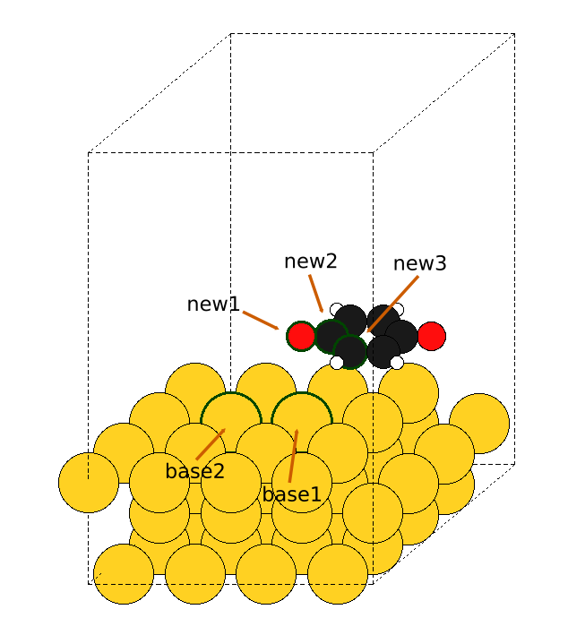
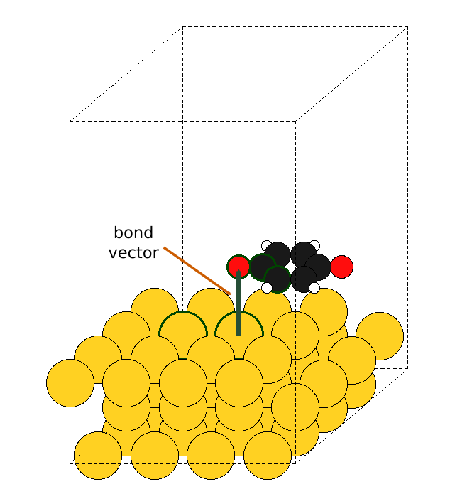
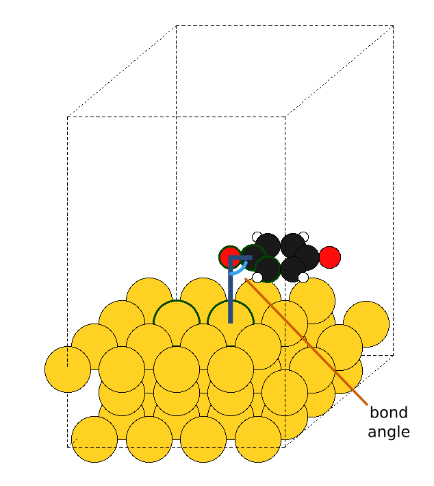
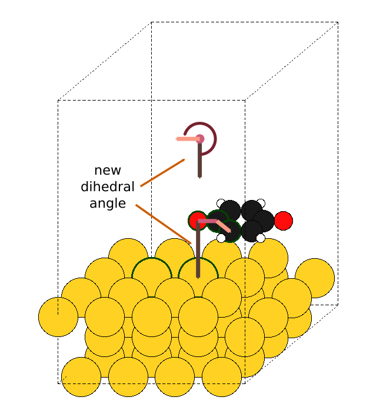

# ** ChemCat
Concatenate chemical structures easily

## Assembling chemical structures has never been so simple
Building input files is part of the theoretical chemist's daily work.

In numerous research projects, the most painful step is assembling chemical bricks together.
In practice, input files are carefully concatenated together using various GUI-based programs (free or not) in a time-consuming and not so controlled way.

This tool aims to provide with a simple yet powerful, command-line based solution for concatenating input files in a controlled way, without additional hassle. Indeed, the assemblage depends only on simple and chemically relevant parameters.

### Parameters

- 5 atomic landmarks: `base1`, `base2`, `new1`, `new2`, `new3`



- Bond vector (base1 -> new1)



- Bond angle (base1, new1, new2)



- Bond dihedral angle (base2, base1, new1, new2)


- New molecular dihedral angle (base1, new1, new2, new3)



And that's it! Only the bare minimum (but complete) set of convenient parameters for merging two structures together.

Definitely, assembling chemical structures has never been so simple! Finally a `cat` command for chemistry...

## A convenient builder for adsorption

You can use the `chemcat.py` Python3 script directly in your terminal, thanks to a rich command-line interface. Simply run in your terminal:
```Bash
python3 chemcat.py -h
```
will display the basic help:
```
usage: chemcat.py [-h] [-bx BOND_VECTOR_X] [-by BOND_VECTOR_Y]
                  [--force_cartesian] [--vasp5] [--sort]
                  base_input_filename new_input_filename base1_index
                  base2_index new1_index new2_index new3_index bond_vector_z
                  bond_angle bond_dihedral_angle new_dihedral_angle
                  output_filename

positional arguments:
  base_input_filename   filename of base input
  new_input_filename    filename of new input
  base1_index           index of base1 atom
  base2_index           index of base2 atom
  new1_index            index of new1 atom
  new2_index            index of new2 atom
  new3_index            index of new3 atom
  bond_vector_z         Z-component of requested bond vector
  bond_angle            requested bond angle (base1, new1, new2)
  bond_dihedral_angle   requested bond dihedral angle (base2, base1, new1,
                        new2)
  new_dihedral_angle    requested new dihedral angle (base1, new1, new2, new3)
  output_filename       filename of concatenated output

optional arguments:
  -h, --help            show this help message and exit
  -bx BOND_VECTOR_X, --bond_vector_x BOND_VECTOR_X
                        X-component of requested bond vector
  -by BOND_VECTOR_Y, --bond_vector_y BOND_VECTOR_Y
                        Y-component of requested bond vector
  --force_cartesian     force writing cartesian coordinates (even if PBC is
                        detected)
  --vasp5               use VASP5 file format
  --sort                sort atomic coordinates (useful for VASP format)
```

### Example

To obtain the adsorbed geometry presented for parameters illustrations, simply run in your terminal:

```Bash
cd ChemCat
python3 chemcat.py demo/Au_slab.POSCAR demo/quinone.POSCAR 42 41 6 2 1 3.0 90 180 270 demo/adsorbed_quinone.POSCAR
```

## A powerful Python3 API

You can also use the `chemcat.py` script as a Python3 module for your specific needs. You can simply import it with:
```Python3
import chemcat
```

A basic API is available for smartly rotating ASE Atoms objects.

A basic API documentation will soon be added here... Keep in touch!

## Installation

Simply download this repository, and look for the `chemcat.py` script. It provides with a command-line interface and can be used as a Python3 module.

Dependencies:
- Python3
- ASE

In the future, a `setup.py` script will be provided for an even easier installation:
- Download this repository
- Execute `python3 ChemCat/setup.py`
- Voilà!

## Q&A
### Is this compatible with periodic boundary conditions?
Yes! You can combine input files with or without periodic boundary conditions. 

Note that the combined unit cell will be defined by ASE, and it will most likely use the unit cell from the first input file.

**Note:** If the added structure has periodic boundary conditions, beware that no minimum image convention transformation will be applied. As a consequence, please make sure that the added structure has coordinates that can be directly treated as a whole (e.g. no bond with adjacent virtual images)

### Are VASP output files compatible with Molden?
Indeed, Molden does not properly handle VASP files written in Cartesian coordinates (with the `Cartesian` keyword). Therefore, by default, output files are written in direct coordinates if PBC are detected.

As a consequence, output files generated with this script should be compatible with Molden!

Note that you can force writing cartesian coordinates by specifying the `--force-cartesian` option for the command-line interface.

### I want periodicity in one direction only, can I use this script?
Probably not. ASE does not currently handle PBC in some directions only. If such systems are detected, a warning message will be displayed...

### How can I adsorb a molecule on a bridge or fcc/hcp site?
Simply provide with a bond vector not aligned with the Z-axis (just remember to define the bond angle accordindly).

Note: for the command line interface, simply use the `-bx` or `-by` options (see `python3 chemcat.py -h` for help)

### The final VASP file is no longer compatible with my POTCAR
By default, ASE is conserving the concatenation order. But you can change that behavior and re-sort all the atomic indexes to group them by atomic type, simply use the `--sort` option for the command-line interface.

### Can I have my final structure in the VASP5 file format?
Yes! ASE supports the VASP5 file format. Simply use the `--vasp5` option for the command-line interface.
