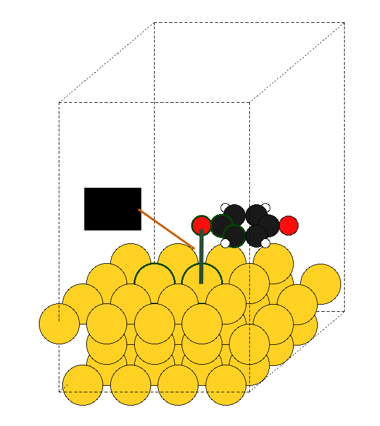
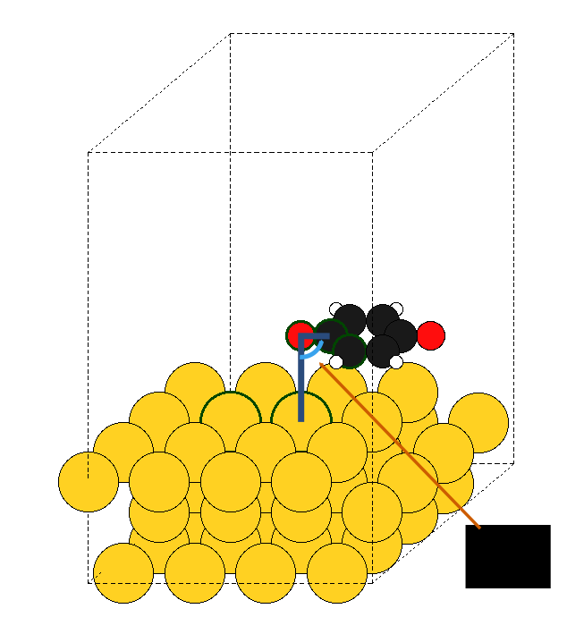

# ** ChemCat
Concatenate chemical structures easily

## Assembling chemical structures has never been so simple
Building input files is part of the theoretical chemist's daily work.

In numerous research projects, the most painful step is assembling chemical bricks together.
In practice, input files are carefully concatenated together using various GUI-based programs (free or not) in a time-consuming and not so controlled way.

This tool aims to provide with a simple yet powerful, command-line based solution for concatenating input files in a controlled way, without additional hassle. Indeed, the assemblage depends only on simple and chemically relevant parameters.

### Parameters

- 5 atomic landmarks: `base1`, `base2`, `new1`, `new2`, `new3`

- Bond vector

- Bond angle

- Bond dihedral angle

- New molecular dihedral angle

Definitely, assembling chemical structures has never been so simple! Finally a `cat` command for chemistry...

## A convenient builder for adsorption

**TODO** `Simple interface for adding adsorbates + add images`

## A powerful Python3 API

**TODO** `As a python3 module...`

## Installation

**TODO** `setup.py`

## Q&A
### Is this compatible with periodic boundary conditions?
Yes! You can combine input files with or without periodic boundary conditions. 

Note that the combined unit cell will be defined by ASE, and it will most likely use the unit cell from the first input file.

### Are VASP output files compatible with Molden?
Indeed, Molden does not properly handle VASP files written in Cartesian coordinates (with the `Cartesian` keyword). Therefore, by default, output files are written in direct coordinates if PBC are detected.

As a consequence, output files generated with this script should be compatible with Molden!

### I want periodicity in one direction only, can I use this script?
Probably not. ASE does not currently handle PBC in some directions only. If such systems are detected, a warning message will be displayed...

### How can I adsorb a molecule on a bridge or fcc/hcp site?
Currently, the command-line interface does not support adsorption not on top. But this is work is progress ;)

In the meantime, you can still use the Python3 API to achieve that, simply change the bond vector (e.g. [1, 1, 2] instead of [0, 0, 2]) and the bond angle accordingly!
